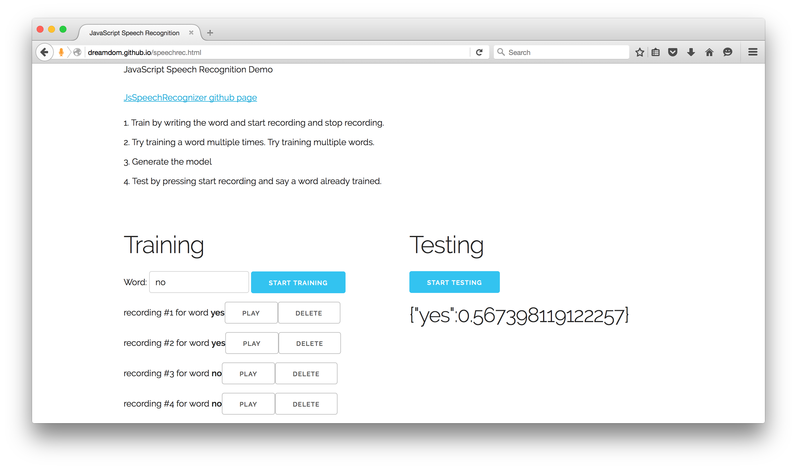
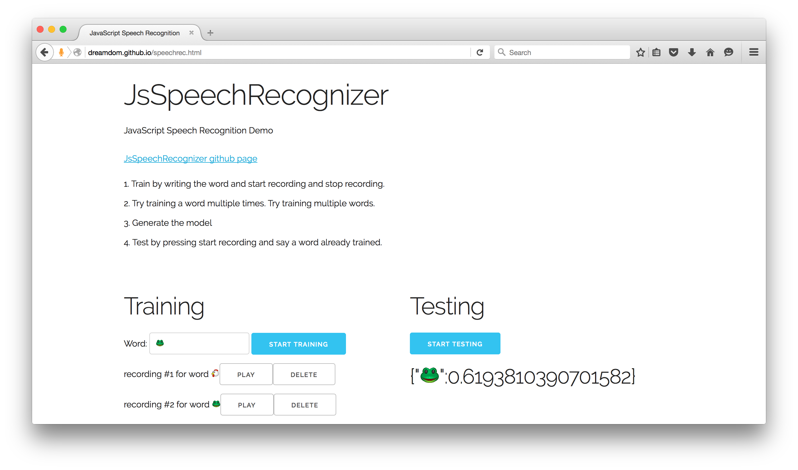

# JsSpeechRecognizer
JavaScript Speech Recognizer

## Demos
[Speech Recognition Demo](https://dreamdom.github.io/speechrec.html)

[Keyword Spotting Demo](https://dreamdom.github.io/demos/keyword-spotting/keyword-spotting.html)

[Video Interaction Live Demo](https://dreamdom.github.io/demos/video-interaction/video-interaction.html)

## Video
Here is a [short video](https://vimeo.com/161142124) of the keyword spotting demo.

And here is a [short video](https://vimeo.com/161726625) of the video interaction demo.

## What is It?
JsSpeechRecognizer is a javascript based speech recognizer. It allows you to train words or phrases to be recognized, and then record new audio to match to these words or phrases.

At the moment, JsSpeechRecognizer does not include any data model, so you will have to train new words before using it.

## How Does it Work?

### WebRTC
JsSpeechRecognizer uses browser WebRTC functionality to get access to the microphone and Fast Fourier Transform (fft) data. Therefore, it will only work in browsers with WebRTC support.

The WebRTC adapter javascript is needed to use the JsSpeechRecognizer. It is hosted on github here. https://github.com/webrtc/adapter

### JsSpeechRecognizer.js
This file contains all of the specific speech recognizer logic.

### Detailed Write Up
For a more detailed write up on how the JsSpeechRecognizer was built click [here](BuildingaSpeechRecognizerinJavaScript.md).

## Live Demo
Play with the Live Demo [here](https://dreamdom.github.io/speechrec.html). It has only been tested in Firefox and Chrome.

### Screenshots



### Tips for the Live Demo

1. Try training the word "yes", and then training the word "no".
2. It is recommended that you train and test in a quiet room.
3. You can (and should) train a word multiple times. This is especially important if you are trying to recognize words that sound very similar such as "no" and "go".
4. Use the "play" button to hear the audio data that was recorded. You should verify that a recording in the training set is of good quality and is of the correct word.
5. If a recording is incorrect, of bad quality, or contains too much noise get rid of it with the "delete" button.

### Fun Stuff

* Try training phrases like "find sushi" or "show me coffee in San Francisco"
* Train and detect laughing or screaming.
* Use emoticons like 🐔, instead of words.
* Train the recognizer with one person, and test with another person.

## More Demos
Find information about more demos [here](https://github.com/dreamdom/JsSpeechRecognizer/tree/master/demos).

I would love to hear more ideas!

## Running the Demos on Your Own Machine
The demo speechrec.html lets you train new words and then recognize them.

### Running in Firefox
Simply open the file speechrec.html. You should get a popup from the browser asking you if you would like to grant the site permission to use the microphone.

### Running in Chrome
If the speechrec.html file is opened as a local file (with a file:/// prefix) the demo will not work by default due to security settings. You can either disable the security (temporarily) or set up a local server to test the file.

I recommend using a Python SimpleHTTPServer. Open up a terminal, cd to the proper folder you want to host, and run the following command:

Python 2
````shell
python -m SimpleHTTPServer 8000
````

Python 3
````shell
python -m http.server 8000
````

Open up "localhost:8000" in your browser to see the list of files in the folder being shared. For more details see the python documentation.
https://docs.python.org/2/library/simplehttpserver.html

Other alternatives include browser-sync or webpack-dev-server.

For more details about Chrome and webrtc locally, see the following stack overflow question:
http://stackoverflow.com/questions/14318319/webrtc-browser-doesnt-ask-for-mic-access-permission-for-local-html-file

### Other Browsers
I have not tested other browsers.
